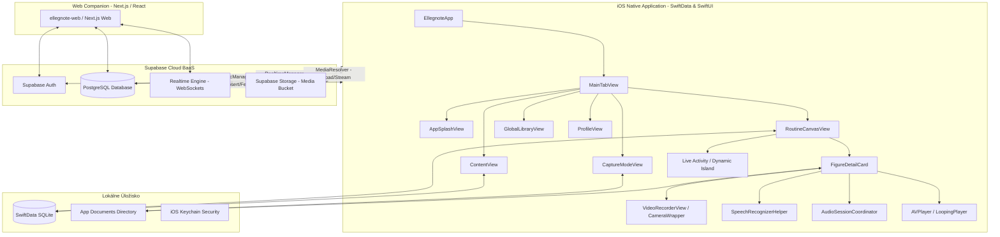

# 💃 ELLEGNOTE — Kompletná Vízia, Architektúra a Detailný Katalóg Kódu

> **Verzia dokumentu:** 2.0 (Deep Codebase Scan)  
> **Dátum:** August 2026  
> **Autor:** Antigravity AI & Jakub  
> **Cieľ:** Jediný referenčný zdroj pravdy (Single Source of Truth) pre celú architektúru, komponenty, dátové toky, synchronizáciu a multimédiá v ekosystéme Ellegnote.

---

## 📑 Obsah
1. [Hlavná Vízia a Riešený Problém](#1-hlavná-vízia-a-riešený-problém)
2. [Celková Architektúra Systému](#2-celková-architektúra-systému)
3. [Detailný Katalóg Súborov (File-by-File Deep Scan)](#3-detailný-katalóg-súborov-file-by-file-deep-scan)
   - [3.1 Koreňové & Konfiguračné Súbory](#31-koreňové--konfiguračné-súbory)
   - [3.2 Dátová Vrstva, Modely & Úložisko](#32-dátová-vrstva-modely--úložisko)
   - [3.3 Cloud, Autentifikácia & Realtime Synchronizácia](#33-cloud-autentifikácia--realtime-synchronizácia)
   - [3.4 Jadro UI, Navigácia & Dizajnový Systém](#34-jadro-ui-navigácia--dizajnový-systém)
   - [3.5 Hlavné Obrazovky & Funkcionality](#35-hlavné-obrazovky--funkcionality)
   - [3.6 Audio, Kamera, Rozpoznávanie Reči & QR](#36-audio-kamera-rozpoznávanie-reči--qr)
   - [3.7 iOS Widget & Live Activity (Dynamic Island)](#37-ios-widget--live-activity-dynamic-island)
   - [3.8 Webová Aplikácia (Next.js & Vite Android Companion)](#38-webová-aplikácia-nextjs--vite-android-companion)
4. [Dátové Toky, Životný Cyklus a Reaktivita](#4-dátové-toky-životný-cyklus-a-reaktivita)
5. [Hĺbková Analýza Audio & Video Subsystému](#5-hĺbková-analýza-audio--video-subsystému)

---

## 1. Hlavná Vízia a Riešený Problém

### Problém v Tanečnom Športe
Tanečné páry a tréneri na individuálnych lekciách spoločenských tancov (Standard & Latin) strácajú drahocenné minúty písaním poznámok do generických textových aplikácií (Apple Notes, Messenger, WhatsApp):
- **Absencia priestorovej orientácie:** Text nedokáže vizualizovať *Line of Dance* (smer tanca), rohy tancodromu ani stred sály.
- **Odpojené médiá:** Tréningové videá a hlasové pokyny trénera končia v galérii fotiek medzi stovkami iných súborov bez väzby na konkrétnu figúru či prechod.
- **Asynchrónnosť partnerov:** Partner a partnerka často trénujú oddelene alebo používajú rôzne platformy (iOS vs. Android), čo spôsobuje neaktuálnosť zostáv.

### Riešenie: Ellegnote
1. **2D Vizuálny Choreografický Canvas (Tancodrom):** Nelineárne rozloženie figúr v priestore s prepojeniami, rytmickým počítaním (Beats Timeline), Cubic Bezier krivkami a poznámkami k prechodom.
2. **1-Tap Quick Capture (Instant Notes):** Rýchle zaznamenanie 15s videa alebo hlasového pokynu trénera s okamžitým prepisom cez Apple Speech Framework / Dictation.
3. **Supabase Realtime Sync & Presence:** Okamžitý prenos zmien a živá vizualizácia partnerových kurzorov na canvase cez WebSockets (Broadcast + Postgres Changes).
4. **Multiplatformový Companion:** Natívna iOS appka s 60/120 FPS plynulosťou + moderná Web PWA appka pre partnerov na Androide/Webe.

---

## 2. Celková Architektúra Systému



---

## 3. Detailný Katalóg Súborov (File-by-File Deep Scan)

---

### 3.1 Koreňové & Konfiguračné Súbory

#### `DatabaseRecoveryManager.swift` (Root)
- **Účel:** Automatická obnova poškodenej alebo nekompatibilnej SwiftData SQLite databázy.
- **Kľúčové funkcie:**
  - `recoverContainer(schema:configuration:)`: Vytvorí časovo označenú zálohu poškodených SQLite súborov (`.store`, `-wal`, `-shm`) do priečinka `DatabaseBackups/<timestamp>`, odstráni pôvodné súbory a nanovo inicializuje čistý `ModelContainer`.
- **Prečo existuje:** Zabraňuje pádu aplikácie pri migračných chybách schémy SwiftData pri aktualizáciách modelu.

#### `MediaStorageManager.swift` (Root)
- **Účel:** Centralizovaný správca práce s lokálnym súborovým systémom (App Sandbox Documents).
- **Kľúčové funkcie:**
  - `documentsDirectory`: Bezpečný prístup k adresáru dokumentov aplikácie.
  - `store(data:prefix:fileExtension:)`: Uloží binárne dáta (obrázok/video) s unikátnym UUID názvom.
  - `copyIntoDocuments` / `moveIntoDocuments`: Presúva dočasné nahrávky z kamery do trvalého sandboxu.
  - `removeFile(named:)`: Bezpečné vymazanie súboru bez hádzania výnimiek.
  - `totalSize(for:)`: Výpočet celkovej veľkosti zoznamu multimédií v bajtoch (používa sa v profile).

#### `Ellegnote/Secrets.xcconfig` & `Secrets.xcconfig.template`
- **Účel:** Bezpečná konfigurácia pre build time.
- **Kľúčové premenné:** `SUPABASE_URL`, `SUPABASE_ANON_KEY`. Zabraňuje úniku API kľúčov do git repozitára.

#### `Ellegnote/Info.plist` & `Ellegnote.entitlements`
- **Účel:** Systémové povolenia a oprávnenia iOS.
- **Kľúčové položky:** `NSCameraUsageDescription`, `NSMicrophoneUsageDescription`, `NSSpeechRecognitionUsageDescription`, `NSPhotoLibraryUsageDescription`, podpora Live Activities (`NSSupportsLiveActivities = YES`).

---

### 3.2 Dátová Vrstva, Modely & Úložisko

#### `Ellegnote/Models.swift`
- **Účel:** Definuje kompletnú doménovú schému SwiftData a počiatočné dáta (seeding).
- **Dátové entity (`@Model`):**
  1. `Dance`: Reprezentuje tanečnú disciplínu (Waltz, Tango, Samba, Cha-Cha...) s kategóriou (Standard/Latin), tempom (MPM/BPM), metodickým popisom, fotkou a videom.
  2. `FigureLibraryItem`: Položka v globálnej knižnici figúr. Obsahuje názov, priradenie k tancu, rytmizáciu, technické poznámky, médiá a príznak `isCustom`.
  3. `Routine`: Choreografická zostava pre konkrétny tanec. Vlastní kaskádovú väzbu `canvasNodes: [CanvasNode]`, sleduje čas aktualizácie `updatedAt` a autora `lastModifiedBy`.
  4. `CanvasNode`: Figúra umiestnená na 2D canvase. Má presné súradnice `x, y`, poradový index `orderIndex`, rytmizáciu, poznámky, video a prechodové poznámky `transitionNotes`.
  5. `InstantNote`: Rýchla poznámka v schránke (vytvorená cez `CaptureModeView`), ktorá obsahuje text a voliteľné video/obrázok pripravené na neskoršie priradenie k figúre.
- **Predvolený Seeding:** Obsahuje kompletnú databázu 100+ oficiálnych medzinárodných figúr pre 10 tancov (Standard & Latin) s presnou rytmizáciou.

#### `Ellegnote/MediaResolver.swift`
- **Účel:** Inteligentný hybridný resolver obrázkov a videí (Local Cache First -> Remote Supabase Fallback).
- **Kľúčové funkcie:**
  - `resolveVideoURL(path:)`: Ak je video lokálne, vráti lokálne `file://` URL. Ak nie, vygeneruje Supabase Storage verejnú URL a na pozadí spustí sťahovanie do lokálneho sandboxu.
  - `resolveImage(path:)`: Používa dvojúrovňovú vyrovnávaciu pamäť (`NSCache` v RAM + lokálny disk). Automaticky optimalizuje a downscaluje obrázky na max 1400px pomocou `preparingForDisplay()`, aby nedochádzalo k preťaženiu pamäte GPU.

#### `Ellegnote/KeychainHelper.swift`
- **Účel:** Bezpečné ukladanie citlivých prihlasovacích údajov do hardvérového iOS Keychain.
- **Kľúčové funkcie:** `saveCredentials()`, `readCredentials()`, `deleteCredentials()`. Používa `kSecAttrAccessibleWhenUnlockedThisDeviceOnly` na ochranu údajov pred neoprávneným prístupom a umožňuje biometrické prihlásenie cez Face ID.

---

### 3.3 Cloud, Autentifikácia & Realtime Synchronizácia

#### `Ellegnote/SupabaseConfig.swift`
- **Účel:** Bezpečné dynamické načítanie `SUPABASE_URL` a `SUPABASE_ANON_KEY` z runtime `Info.plist` (ktoré ich preberá z `Secrets.xcconfig`).

#### `Ellegnote/AuthManager.swift`
- **Účel:** Reaktivný manažér používateľských účtov a relácií (Singleton `@MainActor`).
- **Kľúčové funkcie:**
  - `authStateChanges`: Počúva zmeny stavu autentifikácie bez blokovania UI vlákna.
  - `signIn()`, `signUp()`, `signOut()`: Kompletný auth cyklus prepojený so Supabase Auth.
  - `authenticateWithBiometrics()`: Autentifikácia cez LocalAuthentication (Face ID / Touch ID) s automatickým fallbackom na uložené Keychain heslo.
  - `handleDeepLink(url:)`: Spracovanie potvrdzovacích e-mailových odkazov.

#### `Ellegnote/AuthSheetView.swift`
- **Účel:** Vizuálny dialóg na prihlásenie a registráciu v dizajnovom štýle Warm Cream & Neubrutalism.
- **Funkcie:** Prepínanie medzi prihlásením a registráciou, validácia vstupov, tlačidlo Face ID s haptickou odozvou.

#### `Ellegnote/SupabaseSyncManager.swift`
- **Účel:** Obojsmerná synchronizácia dát na úrovni databázy a súborového úložiska.
- **Kľúčové komponenty:**
  - `@globalActor actor SyncActor`: Serializuje sieťové požiadavky na databázu mimo hlavného vlákna.
  - `RoutineSyncDebouncer`: Združuje rýchle zmeny (napr. ťahanie figúry) a odosiela finálny stav do Supabase po 700ms nečinnosti, čím šetrí sieťové prenosy a kvóty.
  - `syncRoutine()`: Atomický upsert zostavy a jej uzlov s inteligentným mazaním osirotených uzlov.
  - `uploadFileAsync()`: Upload lokálne natočeného videa alebo fotky do Supabase Storage bucketu `ellegnote-media`.

#### `Ellegnote/CanvasRealtimeManager.swift`
- **Účel:** Nízko-latentná WebSocket synchronizácia v reálnom čase (Broadcast + Presence + Postgres Changes).
- **Kľúčové funkcie:**
  - **Broadcast (`node_moved`):** Okamžitý prenos pozície figúry pri ťahaní prstom (latencia < 50ms, nezaťažuje SQL databázu).
  - **Broadcast (`canvas_action`):** Prenos pridania, zmazania alebo úpravy figúry a prechodu medzi partnermi.
  - **Presence (`presenceChange`):** Sledovanie pozície kurzora partnera (`PartnerCursorView`) v reálnom čase na canvase vrátane indikácie, ktorú figúru práve ťahá.
  - **Postgres Changes:** Záložný kanál počúvajúci priame zmeny v tabuľke `canvas_nodes`.
  - **Heartbeat & Auto-Reconnect:** Každých 8 sekúnd overuje stav WebSocket kanála a pri obnove spojenia automaticky vyvolá refresh dát.

#### `Ellegnote/SupabaseSecurityFix.sql`
- **Účel:** SQL migrácia pre Supabase databázu. Nastavuje `REPLICA IDENTITY FULL` pre tabuľku `canvas_nodes`, zapína RLS (Row Level Security) politiky a publikuje tabuľky do `supabase_realtime`.

---

### 3.4 Jadro UI, Navigácia & Dizajnový Systém

#### `Ellegnote/EllegnoteApp.swift`
- **Účel:** Vstupný bod iOS aplikácie (`@main`).
- **Funkcie:**
  - Inicializuje SwiftData `ModelContainer` s automatickým volaním `DatabaseRecoveryManager` pri chybe.
  - Spúšťa seeding predvolených tancov a figúr na skutočnom pozadí (`Task.detached(priority: .background)`), čím garantuje 0ms blokovanie prvého snímku.
  - Obsahuje obsluhu deep linkov pre `AuthManager`.

#### `Ellegnote/MainTabView.swift`
- **Účel:** Hlavný kontajner aplikácie s horizontálnym stránkovaním a plávajúcim dokom.
- **Funkcie:**
  - Používa natívny SwiftUI `ScrollView(.horizontal)` s `.scrollTargetBehavior(.paging)` namiesto `TabView(.page)` pre stopercentnú kontrolu nad zamykaním gest.
  - **AppSplashView Overlay:** Zobrazuje uvítaciu obrazovku a plynule zakrýva načítanie SwiftData.
  - **NativeLiquidGlassDock:** Plávajúci dock s iOS Liquid Glass dizajnom (Home, Knižnica, Profil + stredové tlačidlo pre rýchle video).

#### `Ellegnote/AppSplashView.swift`
- **Účel:** Elegantná úvodná obrazovka s animovaným tanečným logom, rotujúcim zlatým gradientom a personalizovaným privítaním používateľa. Po ~1.1s sa plynule odanimuje cez opacity.

#### `Ellegnote/NavDepth.swift`
- **Účel:** Globálny stavový manažér navigačnej hĺbky (`@MainActor NavDepth.shared`).
- **Funkcie:** Keď používateľ vstúpi na `RoutineCanvasView`, `push()` nastaví `isLocked = true`, čo automaticky skryje plávajúci dock a zamkne gestá horizontálneho stránkovania.

#### `Ellegnote/SwipeBackFix.swift`
- **Účel:** Rozšírenie `UINavigationController` s implementáciou `UIGestureRecognizerDelegate`.
- **Funkcie:** Deaktivuje systémové swipe-back gesto na hrane obrazovky počas práce na canvase, aby nedochádzalo ku kolízii s posúvaním tancodromu.

#### `Ellegnote/Colors.swift`
- **Účel:** Kompletná farebná paleta aplikácie:
  - `themeBg` (#F6F2E9 - Warm Cream)
  - `themeCard` (#FFFFFF - Pure White)
  - `themeDark` (#332211 - Rich Espresso)
  - `themeAccent` (#C65D3B - Terracotta / Rust)
  - `themeBorder` (#EBE4D5 - Soft Beige)
  - `standardBlue` (#587E96 - Dusty Slate Blue pre štandardné tance)
  - `latinPink` (#C67A8C - Dusty Rose pre latinskoamerické tance)
  - `latinRed` (#DC143C - Crimson Red pre varovania a nahrávanie)
  - `amberGold` (#DCA51E - Warm Gold)

#### `Ellegnote/NeubrutalistModifiers.swift`
- **Účel:** Knižnica komponentov a vizuálnych štýlov:
  - `NeubrutalistCardModifier`: Karty s pevným espresso okrajom a ostrým tieňom.
  - `NeubrutalistButtonStyle`: Tlačidlá s reaktívnym fyzikálnym stlačením (posun tieňa).
  - `CreativeCreamButtonStyle`: Prémiové dotykové tlačidlá s haptickou odozvou.
  - `CreativePillButtonStyle`: Plávajúce kapsulové akčné prvky.

#### `Ellegnote/AppleTypewriterTextView.swift`
- **Účel:** Textové pole v štýle Apple Intelligence so svietiacim gradientným okrajom a zvukovým vlnovým ekvalizérom počas diktovania hlasových poznámok trénera.

---

### 3.5 Hlavné Obrazovky & Funkcionality

#### `Ellegnote/ContentView.swift`
- **Účel:** Domovská obrazovka so zoznamom choreografií a kategórií tancov.
- **Funkcie:**
  - Prehľad vytvorených zostáv s indikátormi počtu figúr a dátumu úpravy.
  - Filtrovanie podľa disciplíny (Štandard / Latina).
  - Integrácia importu zostáv cez QR kód (`handleScannedCode`) alebo textový JSON reťazec.
  - Detail jednotlivých tancov s možnosťou úpravy tempa, popisu a ukážkových médií (`DanceCategoryView`, `DanceDetailView`).

#### `Ellegnote/RoutineCanvasView.swift`
- **Účel:** Najdôležitejšia a najkomplexnejšia obrazovka aplikácie — 2D Vizuálny Choreografický Canvas (Tancodrom).
- **Architektúra & Komponenty:**
  - `CanvasGestureView`: Natívny UIKit `UIViewRepresentable` koordinujúci 2-prstový Pan & Pinch zoom bez sekania SwiftUI.
  - `CanvasGridBackground` & `BallroomMarkingsView`: Vykreslenie parketu, Line of Dance a stredu sály.
  - `ConnectionsLayer`: Vykresľovanie prechodových kriviek (Cubic Bezier Spline) s interaktívnymi stredovými tlačidlami pre editáciu prechodu (`TransitionEditSheet`).
  - `CanvasNodeCardView`: Samostatná interaktívna karta figúry s podporou drag & drop, haptiky a zobrazenia rytmu (`BeatsTimelineView`).
  - `MinimapView`: Plávajúca radarová minimapa v pravom hornom rohu s prepočtom súradníc v pomere 110:3000.
  - `DrawingCanvas`: Režim kreslenia voľnou rukou (trajektórie páru na parkete).
  - `FiguresDrawerSheet`: Bočný panel na rýchle pridávanie figúr z knižnice.
  - `QRExportSheet`: Generovanie QR kódu zostavy pre okamžité zdieľanie.
  - `PartnerCursorView`: Živé zobrazenie kurzora a mena pripojeného partnera.
  - `Live Activity Integration`: Automatické spúšťanie a aktualizácia Dynamic Islandu podľa aktuálne cvičenej figúry.

#### `Ellegnote/GlobalLibraryView.swift`
- **Účel:** Globálna encyklopédia tanečných figúr.
- **Funkcie:**
  - Vyhľadávanie v reálnom čase a horizontálny filter podľa tancov.
  - Možnosť pridávať vlastné figúry s rytmizáciou a popisom techniky.
  - `LibraryFigureDetailSheet`: Detail figúry s možnosťou priradenia fotky z galérie (`PhotosPicker`), nahrávania videa cez kameru a importu z rýchlej schránky (`InstantNotesInboxSection`).

#### `Ellegnote/ProfileView.swift`
- **Účel:** Profil tanečníka, štatistiky tréningu, predvoľby a údržba dát.
- **Funkcie:**
  - Výpočet štatistík (počet zostáv, videí, hlasových poznámok, najviac trénovaný tanec, obsadené úložisko na disku).
  - Nastavenie predvoleného jazyka diktovania (SK/EN) a rýchlosti prehrávania videa.
  - Údržbové akcie: Obnovenie oficiálnej knižnice figúr, export všetkých zostáv do JSON, vyčistenie videí a poznámok.
  - Správa tanečného účtu a synchronizácie.

#### `Ellegnote/CaptureModeView.swift`
- **Účel:** Rýchly 1-Tap záznamník (Instant Capture) prístupný priamo zo stredového tlačidla plávajúceho doku.
- **Funkcie:** Umožňuje do 3 sekúnd nahrať krátke tréningové video alebo nadiktovať hlasový pokyn trénera a uložiť ho do schránky `InstantNote` pre neskoršie zaradenie do choreografie na canvase.

---

### 3.6 Audio, Kamera, Rozpoznávanie Reči & QR

#### `Ellegnote/AudioSessionCoordinator.swift`
- **Účel:** Globálny centrálny arbiter (`actor`) pre celú zvukovú vrstvu aplikácie.
- **Riešený problém:** Zabraňuje konfliktom o singleton `AVAudioSession` medzi nahrávaním videa (kamera), prehrávaním videa (AVPlayer) a rozpoznávaním reči (Speech Recognizer).
- **Správa klientov:**
  - `.camera`: Nastavuje kategóriu `.playAndRecord`, mód `.videoRecording`, options `[.allowBluetoothHFP, .defaultToSpeaker]`.
  - `.player`: Nastavuje kategóriu `.playback`, mód `.moviePlayback`.
  - `.speech`: Nastavuje kategóriu `.record`, mód `.measurement`, options `[.duckOthers]`.

#### `Ellegnote/FigureDetailCard.swift` (Kamera & Audio Podsystémy)
- **Komponenty v súbore:**
  - `FigureDetailCard`: Karta detailu figúry s videom, poznámkami, diktovaním a schránkou.
  - `VideoRecorderView` (`UIViewControllerRepresentable`): Natívny Apple štandard cez `UIImagePickerController(sourceType: .camera)`. 
    - **Flash/Blesk:** Nastavený primárne na `picker.cameraFlashMode = .off` (vypnutý blesk, používateľ si ho môže na obrazovke manuálne zapnúť).
    - **Kvalita & Médium:** `UTType.movie.identifier`, `.typeHigh`, podpora prepínania prednej/zadnej kamery, stabilizácia obrazu, živý náhľad a natívne potvrdenie *Use Video* / *Retake*.
    - **Životný cyklus:** Žiadne manuálne nízkoúrovňové vlákna — iOS sám bezpečne spravuje hardware, mikrofón a zápis do `.mp4` súboru bez `EXC_BAD_ACCESS` pádov.
  - `LoopingPlayerUIView` & `LoopingVideoPlayer`: Hardvérovo akcelerovaný bezstratový prehrávač videa pomocou `AVPlayerLooper` a `AVQueuePlayer` s ovládaním rýchlosti (0.5x až 1.5x) a automatickou registráciou cez `AudioSessionCoordinator`.
  - `SpeechRecognizerHelper`: Manažér pre rečové rozpoznávanie cez `SFSpeechRecognizer` (lokalizácia `sk-SK` a fallback) s reaktívnym prepisom hovoreného slova do textu a bezpečnou aktiváciou kategórie `.speech`.

#### `Ellegnote/QRGenerator.swift` & `Ellegnote/QRScannerView.swift`
- **Účel:** Offline prenos a zdieľanie choreografií medzi zariadeniami.
- **Funkcie:**
  - `QRGenerator`: Komprimuje kompletnú choreografiu (uzly, súradnice, rytmus, poznámky) do minifikovaného JSON reťazca a generuje vektorový QR kód cez CoreImage filter `CIQRCodeGenerator`.
  - `QRScannerView`: Hardvérový skener QR kódov cez `AVCaptureMetadataOutput` so simulátorovým testovacím režimom.

---

### 3.7 iOS Widget & Live Activity (Dynamic Island)

#### `Ellegnote/EllegnoteAttributes.swift` & `EllegnoteWigdet/EllegnoteAttributes.swift`
- **Účel:** Dátový kontrakt pre Apple ActivityKit.
- **Štruktúra:**
  - Statické atribúty: `routineName`, `danceName`.
  - Dynamický stav (`ContentState`): `currentFigureName`, `nextFigureName`, `currentFigureIndex`, `totalFigures`, `lastUpdated`.

#### `Ellegnote/EllegnoteWidget.swift` & `EllegnoteWigdet/EllegnoteWidget.swift`
- **Účel:** Vizuálna implementácia Live Activity pre Lock Screen a Dynamic Island na iPhone 14 Pro a novších.
- **Režimy Dynamic Islandu:**
  - **Expanded:** Zobrazuje názov tanca, názov aktuálnej figúry, nasledujúcu figúru so šípkou, počítadlo figúr a živý tréningový časovač.
  - **Compact Leading & Trailing:** Ikona tanca + skratka (napr. WAL) naľavo, index figúry napravo.
  - **Minimal:** Samostatná tanečná ikona.

#### `EllegnoteWigdet/AppIntent.swift`
- **Účel:** Konfiguračný intent pre budúce interaktívne widgety na ploche iOS.

---

### 3.8 Webová Aplikácia (Next.js & Vite Android Companion)

#### `ellegnote-web/src/App.jsx` & `ellegnote-web/src/supabase.js`
- **Účel:** Rýchly React/Vite webový klient optimalizovaný pre Android partnerov.
- **Funkcie:** Pripojenie na rovnaký Supabase projekt, autentifikácia, načítanie `canvas_nodes`, podpora Realtime zmien a zobrazenie prítomnosti používateľov.

#### `web/src/app/` (Next.js 15 App Router Companion)
- **Účel:** Plnohodnotná webová verzia Ellegnote s Next.js server actions, TypeScriptom a Tailwind CSS:
  - `web/src/app/page.tsx`: Landing page s prihlásením.
  - `web/src/app/dashboard/DashboardClient.tsx`: Webový dashboard so zoznamom zostáv a figúr.
  - `web/src/lib/supabase/`: Serverový a klientsky Supabase wrapper s SSR podporou.

---

## 4. Dátové Toky, Životný Cyklus a Reaktivita

### 1. Pohyb figúry na Canvase (Drag & Drop)
```
Používateľ ťahá figúru
   │
   ├─► 1. UI: Okamžitý lokálny posun cez @State dragOffset (60/120 FPS)
   ├─► 2. WebSocket: CanvasRealtimeManager.broadcastNodeMove() -> Partner vidí pohyb (<50ms)
   ├─► 3. Presence: CanvasRealtimeManager.updatePresence() -> Partner vidí kurzor
   │
Prst pustený (onDragEnd)
   │
   ├─► 4. SwiftData: node.x = finalX, context.save() (Lokálny disk)
   └─► 5. Background: SupabaseSyncManager (Debounce 700ms) -> SQL UPDATE v Supabase
```

### 2. Natočenie Videa a Uloženie (Apple Standard)
```
VideoRecorderView (UIImagePickerController)
   │
   ├─► 1. iOS Camera Engine bezpečne nahrá video so zvukom do TMP URL (Flash off by default)
   ├─► 2. Používateľ potvrdí "Use Video"
   ├─► 3. MediaStorageManager.moveIntoDocuments() -> Atómový presun do Sandbox Documents
   ├─► 4. SwiftData: node.videoPath = filename, context.save()
   ├─► 5. Task (Pozadie): SupabaseSyncManager -> Nahrá video do Supabase Media Bucket
   └─► 6. Realtime Broadcast: Ostatní klienti dostanú notifikáciu o novom videu
```

---

## 5. Hĺbkový Audit: 30 Zraniteľných Scenárov a Hraničných Situácií (Stress Audit)

Tento audit detailne sumarizuje 30 reálnych situácií, ktoré môžu pri používaní nastať a na ktoré je potrebné aplikáciu v ďalších fázach optimalizovať a tvrdiť:

| # | Oblasť / Modul | Hraničná Situácia (Edge Case) | Aktuálne Riziko & Dopad | Riešenie / Odporúčanie |
|---|---|---|---|---|
| 1 | **Kamera & Disk** | Používateľ točí dlhé 4K video a na iPhone dôjde voľné miesto na disku. | `UIImagePickerController` vyhodí chybu pri zápise, `moveIntoDocuments` zlyhá. | Pridať kontrolu voľného miesta pred spustením kamery (`freeDiskSpaceInBytes`). |
| 2 | **Kamera & Prerušenie** | Prichádzajúci telefónny hovor alebo alarm počas nahrávania videa. | Hovor preruší reláciu, video sa nemusí uložiť. | Ošetriť `AVAudioSession.interruptionNotification` v koordinátore. |
| 3 | **Kamera & Batéria** | iPhone sa prepne do režimu slabej batérie (Low Power Mode) s obmedzeným výkonom kamery. | Možné zníženie framerate z 60 na 30 FPS. | Zachovať predvolenú vysokú kvalitu, akceptovať systémový throttling. |
| 4 | **Kamera & Rýchle zatvorenie** | Používateľ ihneď po kliknutí na *Use Video* zhodí aplikáciu do pozadia (swipe up). | Background Task nemusí dokončiť presun do `Documents`. | Obaliť ukladanie do `UIApplication.shared.beginBackgroundTask`. |
| 5 | **Fotky & Pamäť** | Výber 48 MPx RAW fotky z knižnice fotografií pre ikonu figúry. | Vysoká pamäťová náročnosť pred downscalingom. | `MediaResolver` už robí 1400px resizing, doplniť kompresiu priamo pri výbere cez `PhotosPicker`. |
| 6 | **Diktovanie & Šum** | Nahrávanie hlasovej poznámky v hlučnej tanečnej sále s hlasnou hudbou. | Rozpoznávanie zachytí text piesne namiesto trénera. | Pridať vizuálny indikátor intenzity mikrofónu (Audio Metering) a manuálny stop. |
| 7 | **Diktovanie & Jazyk** | Tanečník diktuje v angličtine, ale v profile má nastavenú slovenčinu (`sk-SK`). | Nezrozumiteľný alebo skomolený fonetický prepis. | Rýchly prepínač jazyka (SK / EN) priamo vedľa mikrofónu. |
| 8 | **Diktovanie & Dĺžka** | Tréner hovorí nepretržite 3 minúty bez prestávky. | `SFSpeechRecognizer` má systémový limit ~1 minútu na reláciu. | Automaticky segmentovať a reštartovať rozpoznávanie po 50 sekundách. |
| 9 | **Diktovanie & Bluetooth** | Pripojené AirPods sa odpoja alebo vybijú uprostred diktovania poznámky. | Zmena audio route (`routeChangeNotification`) spôsobí pád nahrávacieho input node. | Pridať poslucháč na `AVAudioSession.routeChangeNotification`. |
| 10 | **Canvas & Multi-touch** | Používateľ naraz ťahá 3 figúry rôznymi prstami. | Kolízia viacerých drag gesture stavov na canvase. | Limitovať Drag & Drop na 1 aktívnu figúru naraz (`exclusiveTouch = true`). |
| 11 | **Canvas & Súradnice** | Používateľ presunie figúru ďaleko mimo viditeľného parketu (napr. na súradnice x=15000). | Figúra sa stratí z dohľadu a je ťažké ju nájsť. | Zaviesť bounding box limit (napr. -2000 až +2000 pt) alebo tlačidlo "Vycentrovať parket". |
| 12 | **Canvas & Krivky** | Zostava obsahuje 50+ prepojených figúr s desiatkami Bezier kriviek. | Možný pokles FPS pri plynulom zoomovaní na starších zariadeniach. | Využiť SwiftUI `drawingGroup()` (Metal akcelerácia) pre vrstvu kriviek. |
| 13 | **Canvas & Realtime** | Dva telefóny naraz presúvajú tú istú figúru na opačné strany sály. | Nastáva vizuálne blikanie figúry (Race condition). | Implementovať "Last-Write-Wins" alebo zámok figúry (Node Lock) pri aktívnom ťahaní. |
| 14 | **Canvas & Zmazanie** | Partner A zmaže figúru, zatiaľ čo Partner B má otvorený jej detail. | Partner B upravuje zmazaný uzol, save do SwiftData zlyhá. | Reakcia na Realtime DELETE: automaticky zavrieť `FigureDetailCard` s toast notifikáciou. |
| 15 | **Poznámky & Diakritika** | Import špeciálnych znakov, emoji a viacriadkového textu do rýchlej schránky. | Možné deformovanie formátovania v zozname. | Používať `lineLimit` a elastický editor `AppleTypewriterTextView`. |
| 16 | **Instant Notes & Limit** | Používateľ nazbiera 200 nespracovaných instantných poznámok v schránke. | Preťaženie zoznamu a pomalé scrollovanie v paneli. | Pridať hromadné vymazanie / archiváciu starých poznámok. |
| 17 | **Cloud Sync & Offline** | Tanečník vytvorí 3 zostavy v podzemnej sále bez internetu a po 4 hodinách sa pripojí na Wi-Fi. | Nárazová synchronizácia veľkého množstva zmien. | `SupabaseSyncManager` má offline debouncing, doplniť frontu neúspešných requestov (Sync Queue). |
| 18 | **Cloud Sync & Konflikt** | Offline úprava názvu zostavy na mobile aj webe súčasne. | Lokálna verzia prepíše vzdialenú verziu bez varovania. | Porovnávať `updatedAt` časové značky a upozorniť na konflikt. |
| 19 | **Cloud Storage & Limit** | Používateľ nahrá 50 videí a prekročí limit Supabase Storage (500 MB Free Tier). | Supabase Storage vráti HTTP 413 Payload Too Large. | Zobraziť používateľovi jasnú hlášku a lokálne zachovať video bez blokovania aplikácie. |
| 20 | **Auth & Expirácia tokenu** | JWT token expiroval počas noci a používateľ ráno otvorí aplikáciu offline. | Tiché obnovenie relácie zlyhá bez internetu. | Uchovávať lokálne prihlásený stav v Keychain a obnoviť token hneď po nadviazaní spojenia. |
| 21 | **Auth & Zmena hesla** | Používateľ zmení heslo cez web a v iOS aplikácii má uložené staré heslo v Face ID Keychain. | Face ID zlyhá pri overení voči Supabase Auth. | Detegovať `invalid_credentials` a automaticky vymazať neplatné Keychain heslo s výzvou na zadanie nového. |
| 22 | **QR & Veľkosť dát** | Zostava má 40 figúr a dlhé technické poznámky (veľkosť JSON > 3 KB). | Vygenerovaný QR kód má príliš vysokú hustotu bodov a starší iPhone ho nevie zaostriť. | Komprimovať JSON pomocou Deflate/Gzip pred kódovaním do QR. |
| 23 | **QR & Neplatný formát** | Používateľ naskenuje QR kód reštauračného menu namiesto Ellegnote zostavy. | `JSONDecoder` vyhodí chybu pri dekódovaní. | Validácia schémy s prefixom `ellegnote://routine` a používateľsky prívetivá chybová hláška. |
| 24 | **Live Activity & Výpadok** | Dynamic Island beží na pozadí a aplikácia je uspaná systémom pre nedostatok RAM. | Dynamic Island zamrzne na poslednej figúre. | Nastaviť `staleDate` a ukončiť Live Activity pri `sceneDidEnterBackground` ak tréning skončil. |
| 25 | **Prehrávač & Formát** | Import poškodeného alebo nepodporovaného video kodeku (napr. staré AVI/WMV). | `AVPlayer` zlyhá so statusom `.failed`. | Validácia formátu a zobrazenie chybovej karty namiesto čierneho obdĺžnika. |
| 26 | **Prehrávač & Slučka** | Prehrávanie ultrakrátkeho 0.4s videa v nekonečnej slučke (`AVPlayerLooper`). | Vysoká záťaž CPU pri neustálom seekovaní. | Obmedziť minimálnu dĺžku videa alebo nastaviť pauzu medzi slučkami. |
| 27 | **Tmavý / Svetlý Režim** | Prepnutie Dark Mode počas zobrazenia detailu figúry alebo canvasu. | Možné zlé kontrastné pomery vlastných farieb (Cream/Espresso). | Overené: Neobrutalistická paleta má pevné HSL / Hex hodnoty nezávislé od systémového režimu. |
| 28 | **Rotácia Displeja** | Otočenie iPhonu do Landscape režimu na Canvase a späť. | Prvky ovládania sa môžu prekryť s výrezom Dynamic Islandu. | Ošetriť bezpečné zóny (`safeAreaInsets`) pri horizontálnom držaní. |
| 29 | **Dátová migrácia SwiftData** | Budúca aktualizácia pridá nové polia do modelu `CanvasNode` (napr. 3D rotácia). | SwiftData môže spadnúť na `MigrationError` pri prvom spustení. | `DatabaseRecoveryManager` už robí automatickú zálohu, pripraviť `VersionedSchema` pre produkčné verzie. |
| 30 | **Duplicitný import** | Používateľ 3-krát po sebe importuje tú istú zostavu z QR kódu. | Vytvoria sa 3 identické zostavy s rovnakým názvom. | Detegovať existujúci `routine.id` a opýtať sa: "Nahradiť existujúcu alebo vytvoriť kópiu?". |

---
*Dokumentácia a audit sú aktualizované pre produkčný vývoj Ellegnote iOS.*

